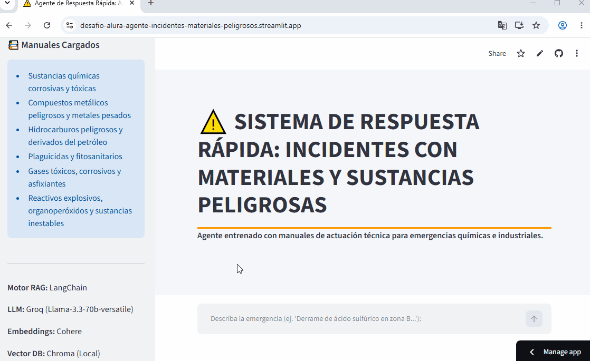

# PROGRAMA ONE G10 - alura + Oracle
## AI FOR TECH - Tech AI Builder
Este desafío forma parte de la etapa **Tech AI Builder** de la formación en intligencia artificial **AI FOR TECH** del programa **ONE - Oracle Next Education**.

# ⚠️ Agente RAG de Respuesta Rápida: Incidentes con Materiales y Sustancias Peligrosas

Este proyecto implementa un Agente de Recuperación Aumentada por Generación (RAG) diseñado para asistir a operarios y despachadores ante emergencias con Materiales Peligrosos. Utiliza manuales técnicos en PDF para proporcionar protocolos de actuación inmediatos, precisos y seguros.

🎥 Demostración del Despliegue

**[Agente de Respuesta Rápida ante Accidentes](https://desafio-alura-agente-incidentes-materiales-peligrosos.streamlit.app/)**

Nota: Despliegue realizado en Streamlit Community Cloud.

⚙️ **Características Principales**

Búsqueda RAG de Alta Precisión: Utiliza manuales técnicos cargados desde un directorio local.

Chunking Semántico: Fragmentación de documentos basada en el significado contextual (usando embeddings de Cohere), mejorando drásticamente la calidad de recuperación frente al chunking de texto plano.

Reescritura de Consultas (Query Rewriting): El sistema toma la consulta bajo estrés del usuario y la optimiza internamente para buscar en la base vectorial con lenguaje técnico preciso.

Baja Latencia (Groq): Implementación de la LPU de Groq con el modelo llama-3.3-70b-versatile para garantizar respuestas rápidas.

Interfaz Orientada a Seguridad: Diseño visual UI/UX simple sin distractores visuales (colores de alerta y precaución).

🛠️ **Tecnologías Utilizadas**

Framework de App: Streamlit

Orquestación RAG: LangChain (y LCEL)

Base de Datos Vectorial: ChromaDB (Local/Embebida)

Embeddings: Cohere (embed-multilingual-v3.0)

LLM (Generación y Reescritura): Groq (llama-3.3-70b-versatile)

Procesamiento de Documentos: PyPDFDirectoryLoader

🚧 **Solución de Problemas y Desafíos Técnicos (Troubleshooting)**

Durante el desarrollo e implementación de este agente, se resolvieron los siguientes desafíos técnicos:

Requisito de Versión de Python: El proyecto fue estabilizado utilizando Python 3.12. Versiones superiores (como 3.14) presentaron incompatibilidades iniciales con ciertas subdependencias de la base vectorial.

Conflicto de Dependencias con Numpy (Error de ChromaDB):

Problema: Al instalar las librerías por defecto, se instaló Numpy 2.0+, lo cual generó un error crítico de compilación y ejecución al intentar inicializar ChromaDB y ciertas funciones de LangChain.

Solución: Fue necesario desinstalar la versión actual e forzar la instalación de una versión anterior estable. Para ello se ejecuta:

> pip uninstall numpy

> pip install "numpy<2.0.0"

> *Idealmente numpy==1.26.4

**Evolución y Selección de Modelos**: Inicialmente se evaluó el uso de modelos locales (HuggingFaceEmbeddings multilingual-e5-small y LLMs locales vía Ollama como gemma3:1b). Se presentaron problemas al utilizar modelos de embeddings de Google AI Studio mediante el uso de API.

**Decisión**: Para un despliegue ágil en Streamlit Cloud y considerando la necesidad de tiempos de respuesta rápidos, se cambió hacia el uso de Groq (llama-3.3-70b-versatile) para inferencia de baja latencia y Cohere para embeddings eficientes y multilingües, evitando sobrecargar la memoria del contenedor de Streamlit.

⚠️ **Descargo de Responsabilidad** (Disclaimer)

Este software es un proyecto de demostración técnica. NO debe utilizarse como fuente de toma de decisiones en una emergencia real de materiales peligrosos. Los protocolos deben ser siempre validados por personal capacitado y los departamentos de higiene y seguridad industrial correspondientes.

> Agente RAG desarrollado para el programa ONE G10 como desafío entregable por Esteban David Galdames.
